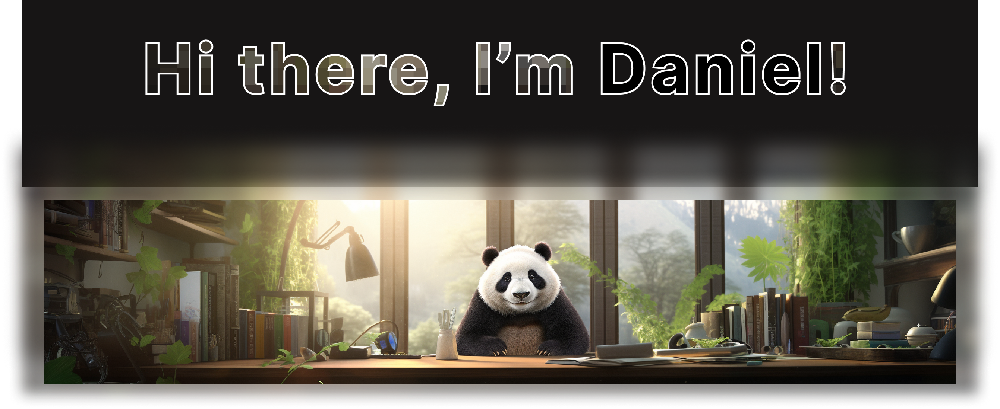

---

### Let's greet ourselves Pythonically, shall we?
```python
def greeting(your_name):
    return f"Hi {your_name}! My name is Daniel, nice to meet you!\n\
    I am pleased to welcome you to my GitHub page"
try:
    print(greeting("insert_your_name"), end="!")
except NameError:
    print("You know you were supposed to change insert_your_name to your name right?\
        \nRemember to use parenthesis too.\
        \n\nDon't fret, it happens even to the best of us! :)")

# correct output should look like:
# Hi Bob! My name is Daniel, nice to meet you!
#   I am pleased to welcome you to my GitHub page!
```
---

<!--## About Me-->

I'm a Computer Science ant deeply passionate about solving problems and building software solutions. I have a knack for 🛠️ coding, automating tasks, and 🌐 web development.

>> _"A person who likes walking, will walk further than the person who likes the destination"_
>
> This sums up my entire career. I do what I love because the destination is merely a byproduct of my journey. That's why I only pursue what I'm interested in. 
>
> Because of that, I don't get tired, but rather love and cherish my job and hobbies, and I'm not afraid to try new things!


>>
>
>

---

## Spoken Languages


---

<!--## 🛠️ Technologies & Tools-->


### IT 👨‍💻:


### Design 🎨:


### IDE's / Editors 🧑🏽‍💻:


### Problem Solving Tools:


---
<!--## 🚀 Some of My Projects-->


| [LicencePy-Verify 🚧 :car: ](https://github.com/34panda/LicencePy-Verify) |[RAIOT 🟡](https://github.com/34panda/docsify) | [Flutter Workout App 🏋️ ](https://github.com/34panda/flutter_workout_app) | [Personal Web Portfolio 🌐 👨‍🚀 ](https://github.com/34panda/web) (Currently inactive) |
|---|---|---|---|
|  |  |  |  |

  
## 🚀 Future Projects (Stay Tuned!)

- 🌐 Personal Portfolio - But better!
- 🌧️ Python Weather Prediction Program
- 🔧 Python Automation Project
- 🎮 Picade Pico-8 Game Update
  
---

<!--## 📈 My GitHub Stats (Just Starting!)-->


<p>
    
    
</p>


---

<!--## 📫 How to reach me-->


You can reach me at [\*mail during changes\*](), or on social media 👇

[](http://www.github.com/34panda)

[](https://www.linkedin.com/in/yourusername/)

[](http://www.yourpersonalwebsite.com)

## ⚡ Fun fact: 
### I love people, feel more then welcome to message me! :)

> ##### Last word of advice:
>> _"Be yourself; everyone else is already taken."_
>>
>>\- Oscar Wilde
>
